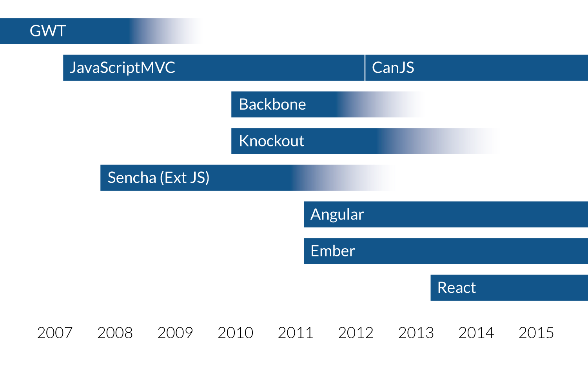

title: 9 Years of JavaScript
output: index.html
theme: theme
controls: false
logo: theme/logo.png

--

# YYC.js Presents

## 9 Years of JavaScript

--

# Brought to you by

-- presenter


## David Luecke

* [<i class="fa fa-github"></i> daffl](https://github.com/daffl)
* [<i class="fa fa-twitter"></i> @daffl](http://twitter.com/daffl)

-- presenter


## Alexis Abril

* [<i class="fa fa-github"></i> alexisabril](https://github.com/alexisabril)
* [<i class="fa fa-twitter"></i> @alexisabril](http://twitter.com/alexisabril)

-- presenter


## Eric Kryski

* [<i class="fa fa-github"></i> ekryski](https://github.com/ekryski)
* [<i class="fa fa-twitter"></i> @ekryski](http://twitter.com/ekryski)
* [<i class="fa fa-home"></i> erickryski.com](http://erickryski.com)

-- sponsors

# Our Sponsors


--

# Last Month

* Something awesome
* More awesomeness

-- sponsors

# A Brief History of SPAs
## ours!


--

# MV* Timeline



--

# A Checklist for Success

## [http://blog.bitovi.com/why-checklist/](http://blog.bitovi.com/why-checklist/)

* Development

* Design

* Managment

### [To the checklist!](http://bitovi.github.io/checklist/)

--

## The major surprise in our data was that development factors are not nearly as meaningful in predicting success as design and management factors.

--

# A Bitovi Case Study

After filling out the checklist in hindsight for all of our previous projects, we calculated influence factors and recorded the correlation to project success for each category.

__We defined success as on time and budget__

--

* Development __.20 ~ .28__
	* code reviews
	* documentation
* Design __.44 ~ .45__
	* user testing
	* design documentation
* Management __.45 ~ .48__
	* vision, goals and strategy
	* release < 6 months

--

# User Testing w/ [FuncUnit](http://funcunit.com)


--

# __FuncUnit__

Functional testing library built on top of __jQuery__ and runs on __QUnit__, __Jasmine__ or __Mocha__:

- Write functional tests in your testing library of choice
- Use jQuery syntax to emulate user input

__Testing a [TodoMVC](http://todomvc.com) app__

```javascript
test('TodoMVC app', function() {
	F('#new-todo').click().type('Do some nerdy stuff\r');
	F('#todo-list li').size(1, 'Got one Todo');
	F('#todo-list li:first label')
		.html('Do some nerdy stuff', 'Todo has correct text');
	F('#todo-count').html(/<strong>1<\/strong>(.*)item(.*)left/,
		'Todo count text is correct');
});
```

--

# 

Testee runs your *Mocha*, *QUnit* or *Jasmine* unit tests from the command line using any browser.

- Runs on all browsers (supporting SocketIO)
- Remote URL testing
- Many output formats
- CI integration
- BrowserStack support
- GruntJS Task
- Code coverage

--

# Continuous Integration

- Use source control management system (SCM) for builds
- Run reports, tests, deploy or other tools on each SCM change
- Popular open source CI servers:
	- [Jenkins](http://jenkins-ci.org/): Probably most popular CI server, formerly Hudson
	- [CruiseControl](http://cruisecontrol.sourceforge.net/): CI framework initially by Thoughtworks
	- [TravisCI](http://travis-ci.org): Distributed build platform for the open source community
- Hosted CI services
	- [Codeship](https://www.codeship.io/): Build and deploy service
	- [Circle CI](https://circleci.com/)
	- [Gitlab CI](https://about.gitlab.com/gitlab-ci/)

--

# Next Month

* Something awesome
* More awesomeness
